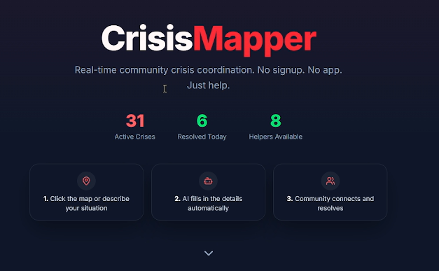
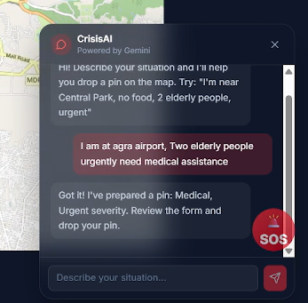
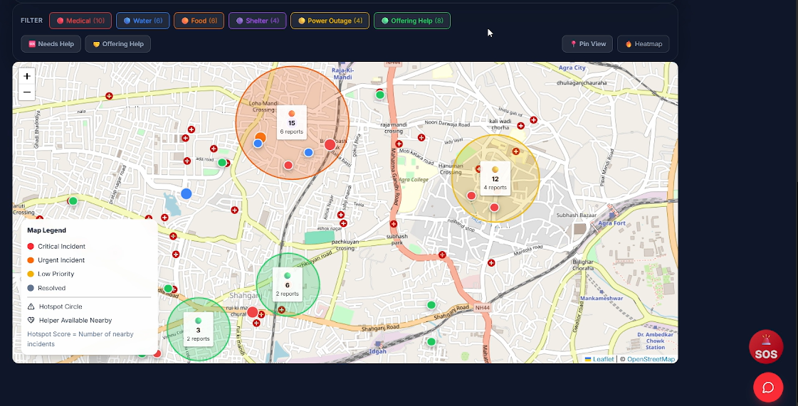
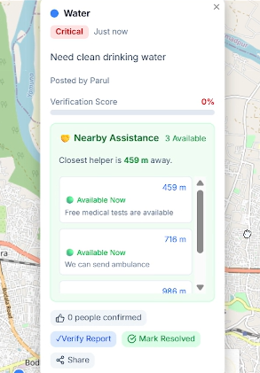

# CrisisMapper AI

> **AI-powered community emergency mapping platform for real-time disaster reporting, geo-verification, and volunteer coordination.**

CrisisMapper AI is a real-time disaster response platform that enables communities to report emergencies, verify incidents using GPS-based witness confirmation, discover nearby helpers, and visualize disaster hotspots. By combining AI-assisted reporting with live mapping and community participation, the platform improves disaster awareness and emergency response.

---

## Demo

🎥 **Video:** https://youtu.be/eUVSs_g53yM?si=f1Sq_-_JDS3q6mY_

---

## Screenshots


```md







```

---

## Features

* AI-assisted incident reporting using Google Gemini
* Interactive live emergency map
* GPS-based witness verification
* Community support and verification score
* Heatmap and hotspot visualization
* Nearby helper discovery
* One-tap SOS emergency reporting
* Live statistics dashboard
* Shareable incident links
* Mark incidents as resolved
* Automatic incident expiry
* Real-time synchronization with Firebase
* Anonymous authentication
* Responsive design

---

## Tech Stack

### Frontend

* React
* Vite
* JavaScript
* Tailwind CSS
* React Leaflet
* Leaflet Heat
* Lucide React

### Backend

* Firebase Firestore
* Firebase Anonymous Authentication

### AI

* Google Gemini API

### Maps

* Leaflet
* OpenStreetMap
* Browser Geolocation API

---

## Project Structure

```text
src/
├── components/
├── hooks/
├── lib/
└── App.jsx
```

---

## Getting Started

### Prerequisites

* Node.js (v18 or later)
* npm
* Firebase Project
* Google Gemini API Key

### Clone Repository

```bash
git clone https://github.com/parulbhadoria/crisis-mapper.git

cd crisis-mapper
```

### Install Dependencies

```bash
npm install
```

### Configure Environment Variables

Create a `.env` file in the project root.

```env
VITE_FIREBASE_API_KEY=

VITE_FIREBASE_AUTH_DOMAIN=

VITE_FIREBASE_PROJECT_ID=

VITE_FIREBASE_STORAGE_BUCKET=

VITE_FIREBASE_MESSAGING_SENDER_ID=

VITE_FIREBASE_APP_ID=

VITE_GEMINI_API_KEY=
```

### Firebase Setup

Create a Firebase project and enable:

* Firestore Database
* Anonymous Authentication

Copy your Firebase configuration values into the `.env` file.

### Run the Project

```bash
npm run dev
```

Visit:

```
http://localhost:5173
```

---

## AI Workflow

1. User describes an emergency.
2. Gemini identifies the category and severity.
3. The report form is automatically populated.
4. User confirms the location.
5. Incident is saved to Firestore.
6. All connected users receive real-time updates.

---

## Future Improvements

* AI image verification
* Offline reporting
* Push notifications
* SMS alerts
* Government dashboard
* Rescue route optimization
* Predictive disaster analytics
* Multi-language support

---

## Contributing

Contributions and suggestions are welcome.

Fork the repository, create a feature branch, and submit a pull request.

---

## License

This project is licensed under the MIT License.

---

## Author

**Parul Bhadoria**

Built using React, Firebase, Leaflet, and Google Gemini AI.
